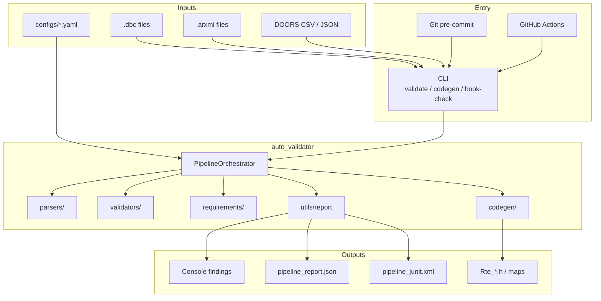
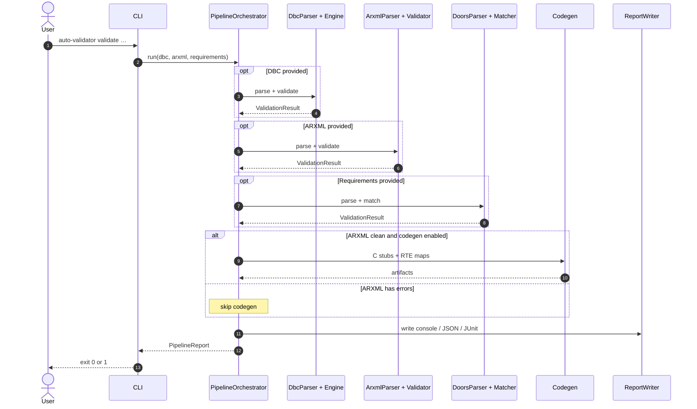
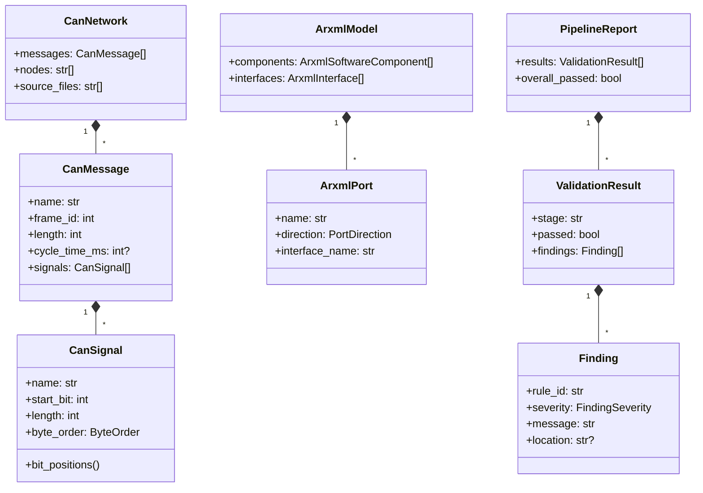
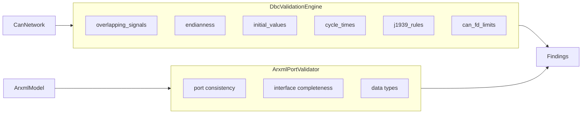
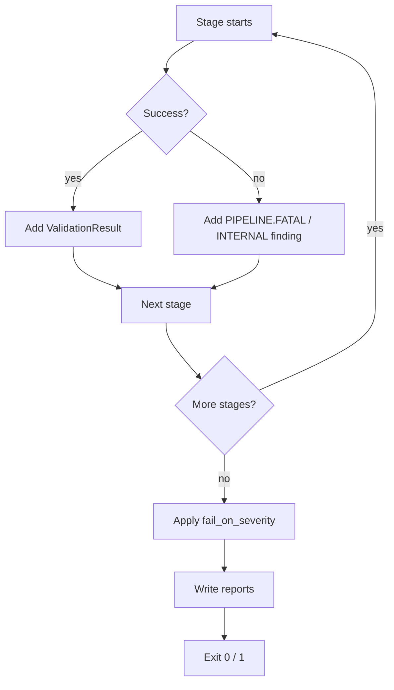

# Architecture

How the DBC/ARXML validator is put together: packages, data flow, and extension points.

For a diagram-only view, see [DIAGRAMS.md](DIAGRAMS.md).

---

## Goals

1. Fail fast on bad DBC/ARXML in git hooks and CI (before Tresos / compile).
2. Keep parse → validate → match → codegen → report as separate steps.
3. Prefer findings over hard crashes so one bad file does not kill the run.
4. Make new DBC/ARXML rules easy to add without rewriting the CLI.

---

## System overview



---

## Package layout

```text
src/auto_validator/
├── cli.py                 # Click commands
├── config.py              # YAML + pydantic settings
├── models/                # CanNetwork, ArxmlModel, Finding, …
├── parsers/               # DBC (cantools), ARXML (lxml), DOORS
├── validators/
│   ├── base.py            # Shared run() wrapper
│   ├── dbc/               # Overlap, endian, init, cycle, J1939, CAN-FD
│   └── arxml/             # Port / interface checks
├── requirements/          # DOORS ↔ artifact matcher
├── codegen/               # C stubs + RTE map files
├── pipeline/              # Orchestrator
└── utils/                 # Logging, retry, reports
```

| Package | Responsibility |
|---------|----------------|
| `parsers/` | Disk → typed models |
| `validators/` | Models → `Finding` list |
| `requirements/` | DOORS names vs DBC/ARXML |
| `codegen/` | ARXML → headers / JSON / C map |
| `pipeline/` | Call stages in order, build `PipelineReport` |
| `utils/` | Cross-cutting helpers |
| `models/` | Shared types (no I/O) |

---

## Runtime sequence (`validate`)



---

## Data model (simplified)



---

## Validation engines



Each DBC checker is a plain function `check_*(network) -> list[Finding]`.  
`DbcValidationEngine` turns them on/off from `configs/default.yaml`.

---

## Failure & retry behavior

| Layer | Behavior |
|-------|----------|
| Parsers | `@retryable` on transient `OSError` / timeouts |
| Validators | Unexpected exceptions → `*.INTERNAL` finding |
| Orchestrator | Stage parse failures → `PIPELINE.FATAL`; continue other stages when possible |
| Codegen | Skipped if ARXML stage has errors |
| CLI exit | Based on `pipeline.fail_on_severity` vs all findings |



---

## How to add a DBC rule

1. Add `validators/dbc/my_rule.py` with `check_*(network) -> list[Finding]`.
2. Call it from `DbcValidationEngine.validate` behind a config flag.
3. Document the rule id in [VALIDATION_RULES.md](VALIDATION_RULES.md).
4. Add a unit test under `tests/unit/`.
5. Optionally add a fixture under `tests/fixtures/dbc/`.

Same idea for ARXML: extend `ArxmlPortValidator` or add a sibling validator.

---

## Related docs

- [DIAGRAMS.md](DIAGRAMS.md) — all Mermaid diagrams in one place  
- [DATA_FLOW.md](DATA_FLOW.md) — inputs → models → outputs  
- [GETTING_STARTED.md](GETTING_STARTED.md) — install and first run  
- [FEATURES.md](FEATURES.md) — feature catalog  
- [CONFIGURATION.md](CONFIGURATION.md) — config keys  
