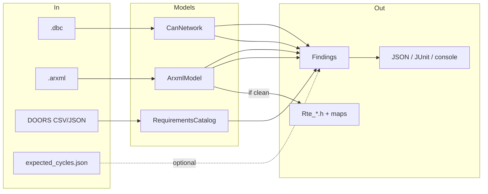
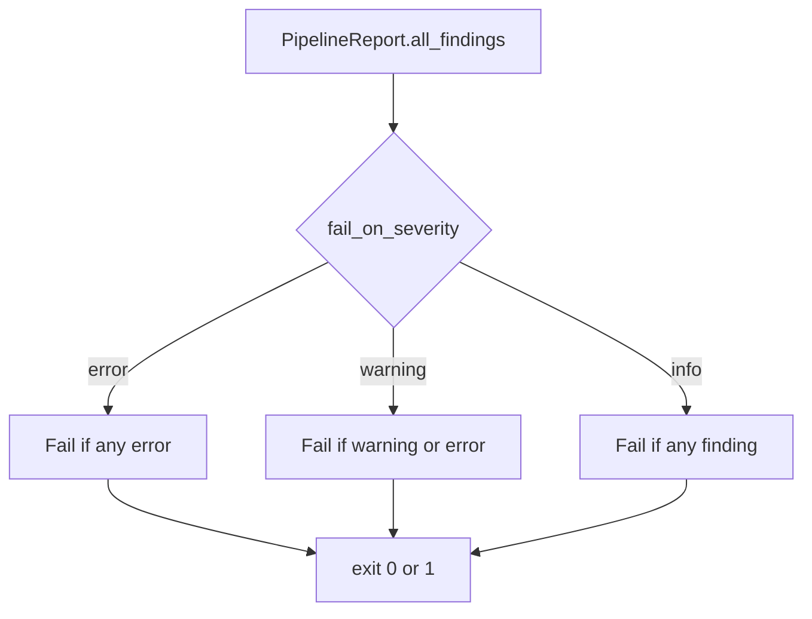

# Data flow

What enters the pipeline, how it is transformed, and what leaves.

---

## Overview



---

## Stage-by-stage

### 1. Parse DBC

| | |
|--|--|
| **Input** | One or more `.dbc` paths |
| **Library** | cantools |
| **Output** | `CanNetwork` (`CanMessage`, `CanSignal`, nodes, flags) |
| **Notes** | Reads `GenMsgCycleTime`, `GenSigStartValue`, FD/J1939 hints when present |

### 2. Validate DBC

| | |
|--|--|
| **Input** | `CanNetwork` (+ optional expected cycle map) |
| **Output** | `ValidationResult(stage="dbc_validation")` |
| **Rules** | Overlap, endian, init, cycle, J1939, CAN-FD — see [VALIDATION_RULES.md](VALIDATION_RULES.md) |

### 3. Parse ARXML

| | |
|--|--|
| **Input** | `.arxml` / `.xml` |
| **Library** | lxml (namespace-tolerant) |
| **Output** | `ArxmlModel` (SWCs, ports, S/R + C/S interfaces) |

### 4. Validate ARXML

| | |
|--|--|
| **Input** | `ArxmlModel` |
| **Output** | `ValidationResult(stage="arxml_validation")` |
| **Rules** | Duplicate ports, missing/unresolved interfaces, empty interfaces, types |

### 5. Parse + match DOORS

| | |
|--|--|
| **Input** | CSV/TSV/JSON + optional `CanNetwork` / `ArxmlModel` |
| **Output** | `ValidationResult(stage="requirements_match")` |
| **Modes** | `strict` (exact) or `fuzzy` (suggestions via difflib) |

### 6. Codegen (conditional)

| | |
|--|--|
| **Input** | `ArxmlModel` with zero ARXML errors |
| **Output** | Files under `arxml.output_dir` |
| **Artifacts** | `Rte_Type.h`, `Rte_<Swc>.h`, `rte_interface_map.json`, `Rte_InterfaceMap.c` |

### 7. Reports

| Format | Path (default) |
|--------|----------------|
| Console | stderr (Rich table) |
| JSON | `output/reports/pipeline_report.json` |
| JUnit | `output/reports/pipeline_junit.xml` |

---

## Finding shape

Every rule hit becomes a `Finding`:

```json
{
  "rule_id": "DBC.OVERLAP.BIT_COLLISION",
  "severity": "error",
  "message": "Overlapping bit 8 in message BadMsg: SignalA vs SignalB",
  "file_path": "tests/fixtures/dbc/invalid_overlap.dbc",
  "location": "BadMsg/SignalB",
  "suggestion": "Adjust start_bit/length so signals do not share bits."
}
```

Findings roll up into per-stage `ValidationResult`, then a top-level `PipelineReport`.

---

## Exit code logic



Default is `error`.
