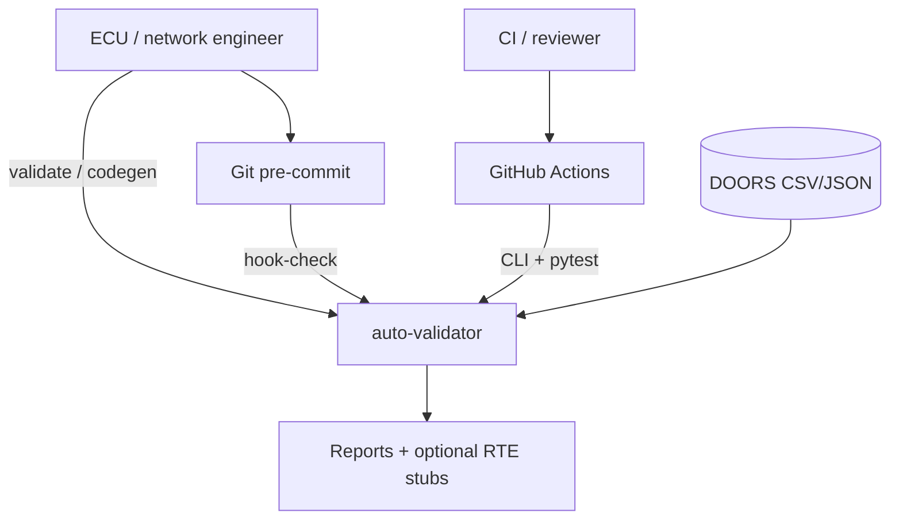
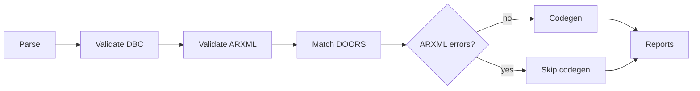
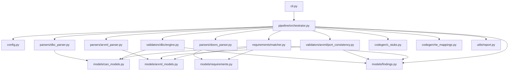
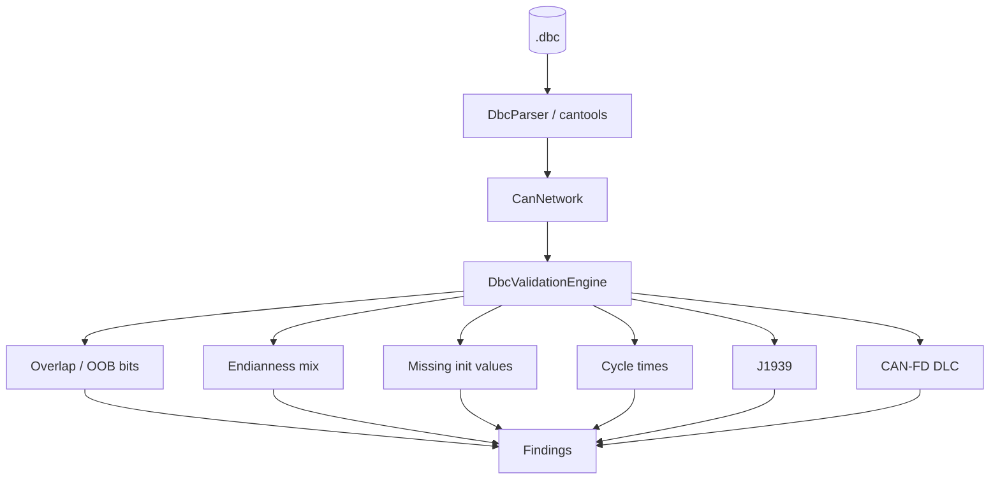
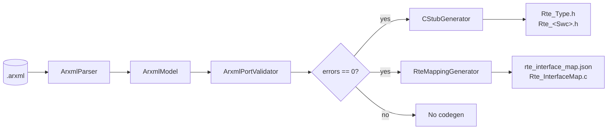
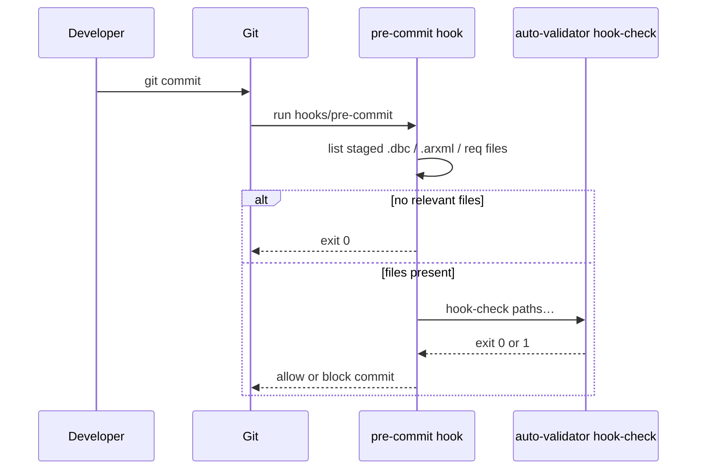
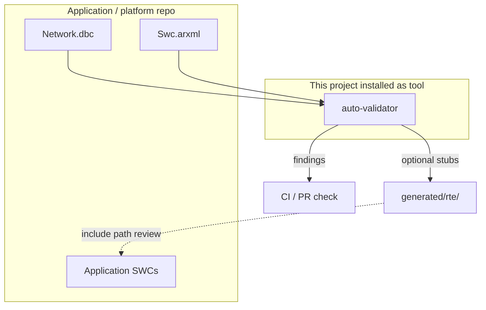

# Architecture diagrams

Mermaid diagrams for the DBC/ARXML validator. GitHub renders these on the docs pages.

Detailed narrative: [ARCHITECTURE.md](ARCHITECTURE.md).

---

## 1. High-level context

Who talks to the tool and what comes out.



---

## 2. Pipeline stages



---

## 3. Component dependencies



---

## 4. DBC validation detail



---

## 5. ARXML → codegen



---

## 6. Git hook path



---

## 7. Deploy / consume in an ECU repo



---

## Editing diagrams

- Diagrams use [Mermaid](https://mermaid.js.org/) fenced as ` ```mermaid `.
- Preview in GitHub, VS Code Mermaid extension, or [mermaid.live](https://mermaid.live).
- Keep node labels short; put detail in the surrounding prose.
