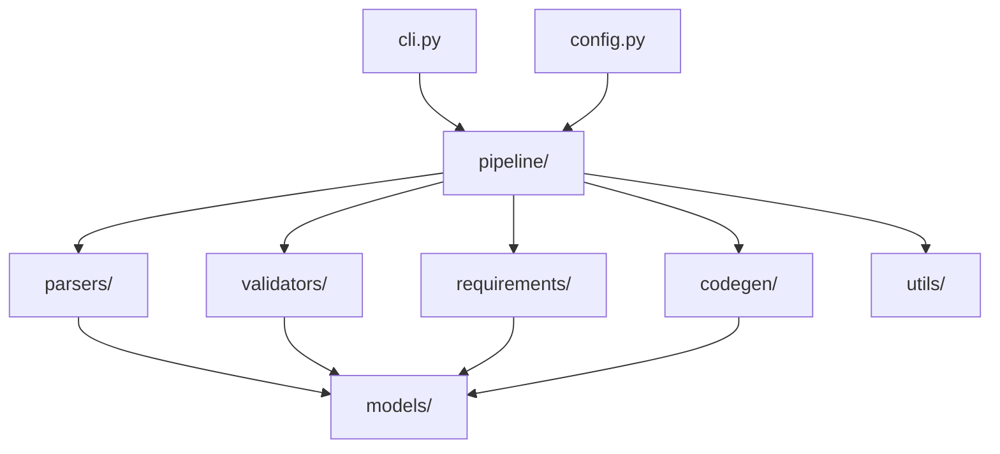

# `auto_validator` package

Python package for the DBC/ARXML validation and codegen CLI.

## Entry points

| How | Module |
|-----|--------|
| `auto-validator` | `auto_validator.cli:main` |
| `python -m auto_validator` | `auto_validator.__main__` |

## Package map

| Package | Role | README |
|---------|------|--------|
| [`models/`](models/README.md) | Typed CAN / ARXML / findings / DOORS types | yes |
| [`parsers/`](parsers/README.md) | DBC, ARXML, DOORS loaders | yes |
| [`validators/`](validators/README.md) | Rule engines | yes |
| [`requirements/`](requirements/README.md) | DOORS matching | yes |
| [`codegen/`](codegen/README.md) | C stubs + RTE maps | yes |
| [`pipeline/`](pipeline/README.md) | Stage runner | yes |
| [`utils/`](utils/README.md) | Logging, retry, reports | yes |

## Top-level modules

| File | Role |
|------|------|
| `cli.py` | Click commands |
| `config.py` | Load YAML → `AppConfig` |
| `__init__.py` | `__version__` |

## Docs

- [Architecture](../../docs/ARCHITECTURE.md)
- [Diagrams](../../docs/DIAGRAMS.md)
- [Features](../../docs/FEATURES.md)
