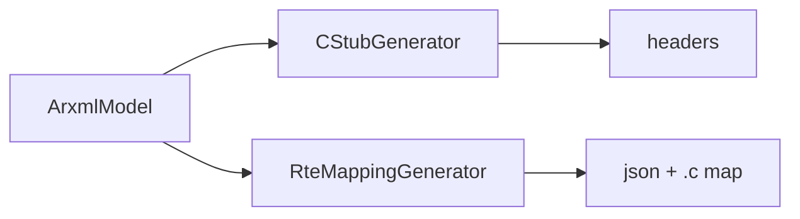

# Codegen

Build reviewable RTE-style artifacts from a validated `ArxmlModel`.

## Generators

| Class | Outputs |
|-------|---------|
| `CStubGenerator` | `Rte_Type.h`, `Rte_<Swc>.h` |
| `RteMappingGenerator` | `rte_interface_map.json`, `Rte_InterfaceMap.c` |

Runs only when ARXML validation has **no errors** (unless you use a path that bypasses the gate).

Details: [CODEGEN.md](../../../docs/CODEGEN.md), diagram: [DIAGRAMS.md](../../../docs/DIAGRAMS.md) §5.
