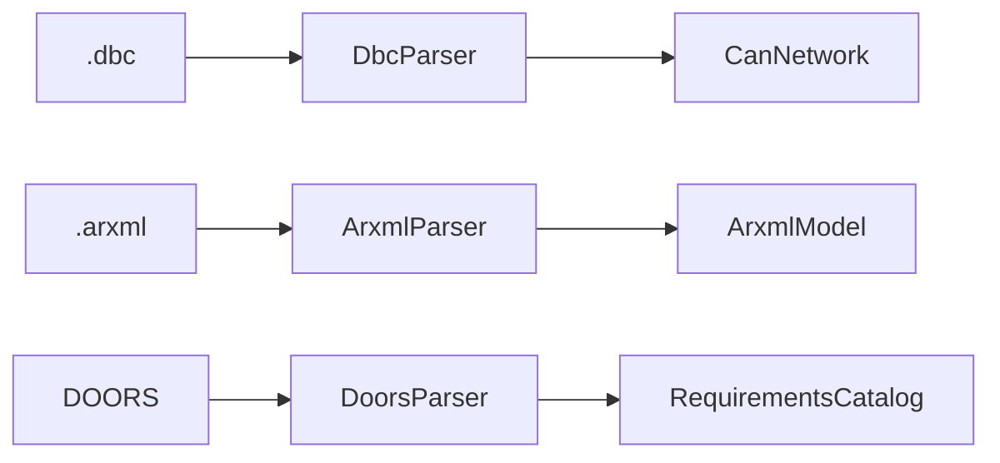

# Parsers

Turn files on disk into models. All three use `@retryable` for flaky I/O.

## Components

| Class | File | In | Out |
|-------|------|----|-----|
| `DbcParser` | `dbc_parser.py` | `.dbc` | `CanNetwork` |
| `ArxmlParser` | `arxml_parser.py` | `.arxml` | `ArxmlModel` |
| `DoorsParser` | `doors_parser.py` | `.csv` / `.json` | `RequirementsCatalog` |

## Notes

- **DBC** — cantools, `strict=False`; merges multiple files via `parse_files()`.
- **ARXML** — lxml, AUTOSAR 4.x-ish; SWCs, P/R/PR ports, S/R + C/S interfaces only (not a full Tresos parser).
- **DOORS** — column names configurable; common aliases accepted.

Docs: [DATA_FLOW.md](../../../docs/DATA_FLOW.md), [FEATURES.md](../../../docs/FEATURES.md).
