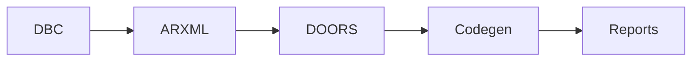

# Pipeline

Runs parse → validate → match → codegen → report.

## `PipelineOrchestrator`

```python
from auto_validator.config import load_config
from auto_validator.pipeline import PipelineOrchestrator

orch = PipelineOrchestrator(load_config("configs/default.yaml"))
report = orch.run(
    dbc_files=["network.dbc"],
    arxml_files=["swc.arxml"],
    requirements_files=["doors.csv"],
)
print(report.overall_passed, report.total_errors)
```

## Stage order



| Stage | Skip when |
|-------|-----------|
| DBC | no `--dbc` or `dbc.enabled: false` |
| ARXML | no `--arxml` or `arxml.enabled: false` |
| DOORS | no `--requirements` or `requirements.enabled: false` |
| Codegen | `--skip-codegen`, no ARXML, or ARXML errors |

See [ARCHITECTURE.md](../../../docs/ARCHITECTURE.md) and [DATA_FLOW.md](../../../docs/DATA_FLOW.md).
