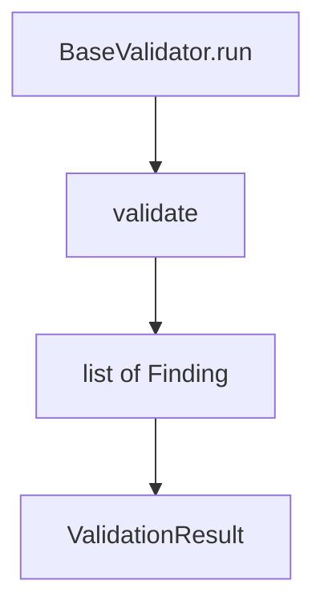

# Validators

Rule engines that emit `Finding` objects. Shared base: `BaseValidator.run()`.

## Layout

```text
validators/
├── base.py
├── dbc/          # overlapping, endian, init, cycle, J1939, CAN-FD + engine
└── arxml/        # port / interface consistency
```



## DBC

`DbcValidationEngine` runs checkers gated by `dbc.rules.*` in config.  
Details: [dbc/README.md](dbc/README.md).

## ARXML

`ArxmlPortValidator` checks ports, empty interfaces, and types.  
Details: [arxml/README.md](arxml/README.md).

## Adding a rule

1. Implement `check_*(…) -> list[Finding]`
2. Wire into the engine/validator + config flag
3. Document in [VALIDATION_RULES.md](../../../docs/VALIDATION_RULES.md)
4. Add unit tests

Diagrams: [DIAGRAMS.md](../../../docs/DIAGRAMS.md) §4.
