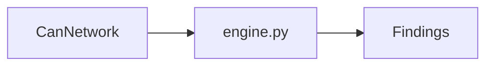

# DBC validators

CAN / J1939 / CAN-FD checkers composed by `DbcValidationEngine`.

| Module | What it flags |
|--------|----------------|
| `overlapping_signals.py` | Shared bits, bits past DLC |
| `endianness.py` | Mixed Intel/Motorola in one message |
| `initial_values.py` | Missing GenSigStartValue |
| `cycle_times.py` | Missing / bad / mismatched cycle times |
| `j1939_rules.py` | Extended ID, PGN, SA, length issues |
| `can_fd_limits.py` | Classic & FD payload length rules |
| `engine.py` | Runs the above from config |

Rule IDs: [VALIDATION_RULES.md](../../../../docs/VALIDATION_RULES.md).
