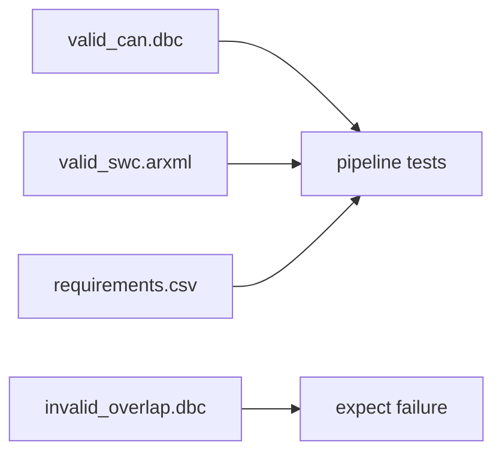

# Test fixtures

Sample inputs for unit and integration tests.

## DBC (`dbc/`)

| File | Intent |
|------|--------|
| `valid_can.dbc` | Clean classic CAN (init + cycle times) |
| `invalid_overlap.dbc` | Overlapping signals → must fail |
| `j1939_sample.dbc` | Extended / J1939-style sample |
| `can_fd_invalid.dbc` | Bad CAN-FD length → must fail FD rules |

## ARXML (`arxml/`)

| File | Intent |
|------|--------|
| `valid_swc.arxml` | SWC with S/R + C/S ports (codegen source) |
| `invalid_ports.arxml` | Unresolved interface + empty S/R |

## DOORS (`doors/`)

| File | Intent |
|------|--------|
| `requirements.csv` | Aligned with valid DBC/ARXML |
| `requirements.json` | Includes a ghost signal for matcher errors |
| `expected_cycles.json` | Message → cycle_ms for mismatch tests |

Guide: [TESTING.md](../../docs/TESTING.md).
